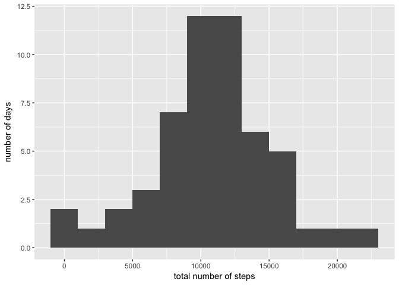
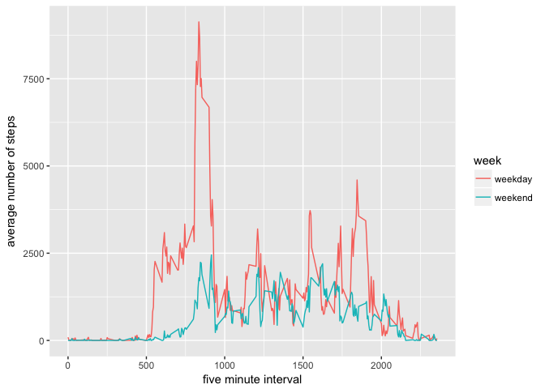

```r
library(dplyr)
```

```
## 
## Attaching package: 'dplyr'
```

```
## The following objects are masked from 'package:stats':
## 
##     filter, lag
```

```
## The following objects are masked from 'package:base':
## 
##     intersect, setdiff, setequal, union
```

```r
library(ggplot2)
```

The activity data will be downloaded and read into a dataframe.  A duplicate dataframe, without empty cells will also be generated.


```r
fileURL <- "https://d396qusza40orc.cloudfront.net/repdata%2Fdata%2Factivity.zip"
download.file(fileURL, destfile = "activity.zip")
df <- read.csv(unzip("activity.zip"))
Sys.setenv(TZ = "US/Central")
df$date <- as.POSIXct(df$date, "%Y-%m-%d", tz = "US/Central")
dfa <- df[!is.na(df$steps), ]
```

Calculate the average total steps per day and then plot the distribution of total steps per day.


```r
steps <- as.data.frame(tapply(dfa$steps, dfa$date, sum))
colnames(steps) <- c("total_steps")
print(paste("Average number of steps per day: ", round(mean(steps$total_steps), 0), sep =""))
```

```
## [1] "Average number of steps per day: 10766"
```

```r
ggplot(steps, aes(x=total_steps))+
        geom_histogram(binwidth = 2000)+
        labs(x = "total number of steps", y = "number of days")
```

<!-- -->

Plot the activity during the day.


```r
intervals <- dfa %>%
        group_by(interval) %>%
        summarise(average_steps = sum(steps))
most <- subset(intervals, average_steps == (max(intervals$average_steps)))
print(paste("Most active 5 minute interval: ", most$interval, sep = ""))
```

```
## [1] "Most active 5 minute interval: 835"
```

```r
ggplot(intervals, aes(x=interval, y = average_steps))+
        geom_line()+
        labs(x = "five minute interval", y = "average number of steps")
```

<!-- -->
Impute the average value for each interval for all missing values.


```r
print(paste("Number of missing values:", sum(is.na(df$steps)), sep = " "))
```

```
## [1] "Number of missing values: 2304"
```

```r
x <- mean(df$steps, na.rm = TRUE)
y <- tapply(df$steps, df$interval, mean, na.rm = TRUE)
empties <- df[(is.na(df$steps)), ]
empties$steps <- y
newDF <- rbind(dfa, empties)
steps2 <- as.data.frame(tapply(newDF$steps, newDF$date, sum))
colnames(steps2) <- c("total_steps")
print(paste("Average number of steps per day: ", round(mean(steps$total_steps), 0), sep =""))
```

```
## [1] "Average number of steps per day: 10766"
```

```r
ggplot(steps2, aes(x=total_steps))+
        geom_histogram(binwidth = 2000)+
        labs(x = "total number of steps", y = "number of days")
```

<!-- -->


Compare the activity patterns between weekdays and weekends.


```r
dfa$day <- weekdays(dfa$date, abbreviate = TRUE)
dfw <- dfa[(dfa$day =="Mon" | dfa$day =="Tue" | dfa$day == "Wed" |dfa$day == "Thu" | dfa$day == "Fri"), ]
dfw$week <- c("weekday")
dfe <- dfa[(dfa$day =="Sat" | dfa$day =="Sun"), ]
dfe$week <- c("weekend")
dfn <- rbind(dfw, dfe)
dfn$week <- as.factor(dfn$week)
int <- dfn %>%
        group_by(week, interval) %>%
        summarise(average_steps = sum(steps))
ggplot(int, aes(x=interval, y = average_steps, col = week))+
        geom_line()+
        labs(x = "five minute interval", y = "average number of steps")
```

<!-- -->
